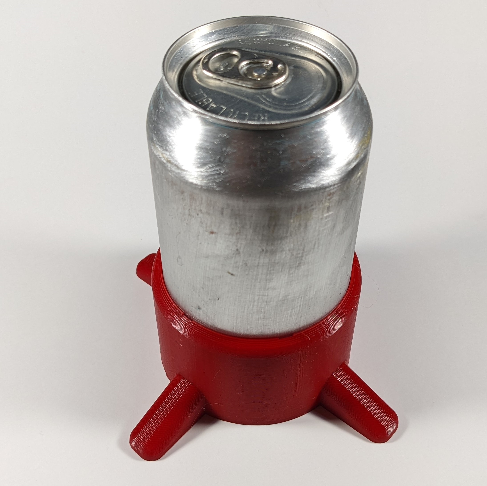

# Can Stabilizer
The Can Stabilizer is a 3D printed aid that helps stabilize a beverage can. This version of the device is intended for standard 211 cans with a diameter of 66 mm (e.g., 355 mL / 12 Oz). The stabilizer makes it easier for those with limited hand dexterity to open the can or form a secure grip with less chance of the can spilling over.

## More info at
- [Makers Making Change Project Page](https://makersmakingchange.com/project/can-stabilizer/ )

## How to Obtain a Can Stabilizer
### 1. Do it Yourself (DIY) or Do it Together (DIT)

This is an open-source assistive technology, so anyone is free to build it. All of the files and instructions required to build the Can Stabilizer are contained within this repository. Refer to the Maker Guide below.

### 2. Request a build of this device

If you would like to obtain a Can Stabilizer , you may submit a build request through the [MMC Library Page](https://makersmakingchange.com/project/can-stabilizer/). The requestor is responsible for the cost of materials and any shipping.

### 3. How to build this device for someone else

If you have the skills and equipment to build this device, and would like to donate your time to create the switch for someone who needs it, visit the [MMC Maker Wanted](https://makersmakingchange.com/maker-wanted/) section.

## Getting Started

### 1. Read the Makers Guide

All of the information to create the Can Stabilizer is contained within the Makers Guide.

### 2. Print the 3D Printable components

The Can Stabilizer consists of a single 3D printed component.

Te files can can be found in the [/Build_Files/3D_Printing_Files](/Build_Files/3D_Printing/) folder.

## Files
### Documentation
| Document             | Version | Link |
|----------------------|---------|------|
| Design Rationale     | 1.0     | [Can_Stabilizer_Design_Rationale](/Documentation/Can_Stabilizer_Design_Rationale_v1.0.pdf)     |
| Maker Guide      | 1.0     | [Can_Stabilizer_Maker_Guide](/Documentation/Can_Stabilizer_Maker_Guide_v1.0.pdf)     |
| Bill of Materials    | 1.0     | [Can_Stabilizer_Bill_of_Materials](/Documentation/Can_Stabilizer_BOM_v1.0.xlsx)     |
| User Guide           | 1.0     | [Can_Stabilizer_User_Guide](/Documentation/Can_Stabilizer_User_Guide_v1.0.pdf)    |
| Changelog            | 1.0     | [Can_Stabilizer_Changelog](/Documentation/Can_Stabilizer_Changelog_v1.0.pdf)     |

### Design Files
 - [CAD Files](/Design_Files)

### Build Files
 - [3D Printing Files](/Build_Files/3D_Printing)

## Attribution
 - Design: Mark Fuglevand.
 - Documentation: Neil Squire / Makers Making Change.

## License
The Can Stablizer is published under a Creative Commons Attribution-ShareAlike 4.0 license https://creativecommons.org/licenses/by-sa/4.0/ (CC BY-SA 4.0).

---
<!-- ABOUT MMC START -->
## About Makers Making Change

Makers Making Change is an initiative of [Neil Squire](https://www.neilsquire.ca/), a Canadian non-profit that helps people with disabilities.

We are committed to creating a network of volunteer makers who support people with disabilities in their communities through 3D printing assistive devices. Check out our library of free, open-source assistive technologies with parts and build instructions.

 - Website: [www.MakersMakingChange.com](https://www.makersmakingchange.com/)
 - GitHub: [https://github.com/makersmakingchange](https://github.com/makersmakingchange)
 - Twitter: [@makermakechange](https://twitter.com/makermakechange)
 - Instagram: [@makersmakingchange](https://www.instagram.com/makersmakingchange)

## Contact Us

For technical questions, to get involved, or share your experience we encourage you to visit the [MMC Website](https://www.makersmakingchange.com/), [MMC Forum](https://makersmakingchange.com/forum), or contact info@makersmakingchange.com

<!-- ABOUT MMC END -->
